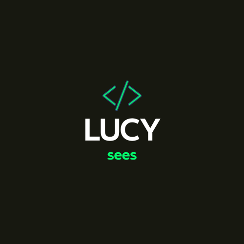
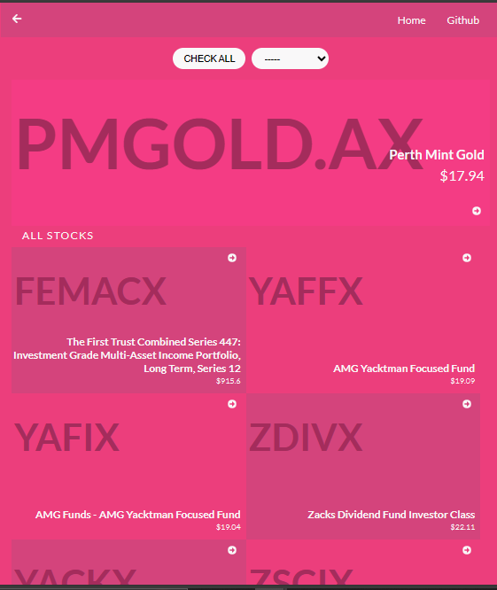
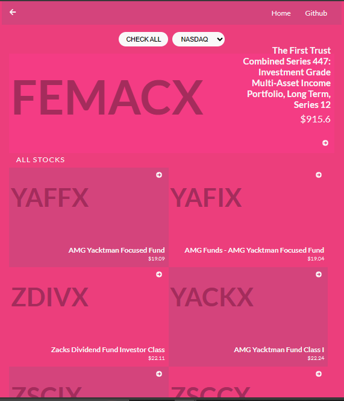

<a name="readme-top"></a>

<div align="center">

  

<h3><b>Stock API App</b></h3>

</div>

# 📗 Table of Contents

- [📗 Table of Contents](#-table-of-contents)
- [📖 Stock API App ](#-metrcs-app-)
  - [🛠 Built With ](#-built-with-)
    - [Tech Stack ](#tech-stack)
    - [Key Features ](#key-features)
  - [🚀 Live Demo](#live-demo)
  - [💻 Getting Started ](#-getting-started-)
    - [Prerequisites](#prerequisites)
    - [Setup](#setup)
    - [Install](#install)
    - [Usage](#usage)
    - [Run tests](#run-tests)
    - [Deployment](#deployment)
  - [👥 Authors ](#-authors-)
  - [🔭 Future Features ](#-future-features-)
  - [🤝 Contributing ](#-contributing-)
  - [⭐️ Show your support ](#️-show-your-support-)
  - [🙏 Acknowledgments ](#-acknowledgments-)
  - [📝 License ](#-license-)


# 📖 Stocks API App <a name="about-project"></a>

The Stocks API App is a website that allows you to:

- Fetch stock data from API.
- Render and display stock data on a UI.

## 🛠 Built With <a name="built-with"></a>

### Tech Stack <a name="tech-stack"></a>

- React.js
- JavaScript
- CSS
- Bootstrap
- Redux
- Redux Toolkit
- API/Testing

### Key Features <a name="key-features"></a>

- **Home Page Details** 

  

- **Stock Details**

  

  Original design idea by [Nelson Sakwa on Behance](https://www.behance.net/sakwadesignstudio).

<p align="right">(<a href="#readme-top">back to top</a>)</p>

## 🚀 Live Demo <a name="live-demo"></a>

[Live Demo Link](https://stocks-api-app.onrender.com/)

[Video resentation Link](https://www.loom.com/share/82cec6044f684fae9ef037d213c86210?sid=dce978c5-bbac-4a55-b5e6-9d58d088bc4c)

<p align="right">(<a href="#readme-top">back to top</a>)</p>

## 💻 Getting Started <a name="getting-started"></a>

To get a local copy up and running, follow these steps.

### Prerequisites

In order to run this project you need [Node.js](https://nodejs.org/en/) installed on your machine.

### Setup

Clone this repository to your desired folder:

```sh
  cd my-folder
  git clone git@github.com:lucy-sees/metrics-app.git
```

### Install

Install the dependencies with:

```sh
  npm install
```

### Usage

To run the project, execute the following command:

```sh
  npm start
```

### Run tests

To run tests, run the following command:

```sh
  npm run test
```

### Deployment

You can deploy this project using:

```sh
  npm run build
```

<p align="right">(<a href="#readme-top">back to top</a>)</p>


## 👥 Authors <a name="authors"></a>

👤 **Lucy W. Mwangi**

- GitHub: [@lucy-sees](https://github.com/lucy-sees)
- Twitter:[@lucy_w_mwangi](https://twitter.com/lucy_w_mwangi)
- LinkedIn: [Lucy Wanjiru Mwangi](https://www.linkedin.com/in/lucy-wanjiru-mwangi)

<p align="right">(<a href="#readme-top">back to top</a>)</p>

## 🔭 Future Features <a name="future-features"></a>

- [ ] **Responsive design**
- [ ] **Stock Market Analysis page**

<p align="right">(<a href="#readme-top">back to top</a>)</p>


## 🤝 Contributing <a name="contributing"></a>

Contributions, issues, and feature requests are welcome!

Feel free to check the [issues page](https://github.com/lucy-sees/metrics-app/issues).

<p align="right">(<a href="#readme-top">back to top</a>)</p>

## ⭐️ Show your support <a name="support"></a>

If you like this project, please consider giving it a star.

<p align="right">(<a href="#readme-top">back to top</a>)</p>


## 🙏 Acknowledgments <a name="acknowledgements"></a>

I would like to thank all code reviewers for making this project better.

<p align="right">(<a href="#readme-top">back to top</a>)</p>


## 📝 License <a name="license"></a>

This project is [MIT](https://github.com/lucy-sees/metrics-app/blob/e0f1f0e0b78d845bafd9bb37dfcccdbc510e7a4f/LICENSE) licensed.

<p align="right">(<a href="#readme-top">back to top</a>)</p>
